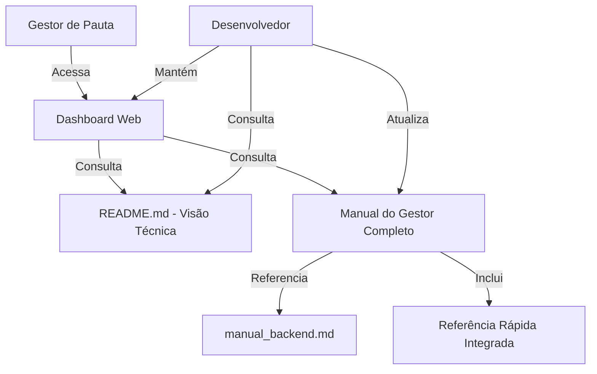

# Design Document: Documentação do Dashboard de Check-in de Audiências

## Overview

Este documento descreve o design da documentação completa do dashboard de check-in de audiências. A documentação será organizada em dois documentos principais:

1. **README.md atualizado**: Documentação técnica para desenvolvedores
2. **doc/manual_gestor_dashboard.md**: Manual completo do usuário para gestores de pauta (incluindo referência rápida integrada)

O manual do gestor seguirá o mesmo estilo e estrutura do `doc/manual_backend.md` existente, mantendo consistência na documentação do sistema.

A abordagem de design prioriza:
- **Consistência**: Mesmo estilo do manual_backend.md existente
- **Documento único**: Manual completo com referência rápida integrada ao final
- **Linguagem apropriada**: Técnica para desenvolvedores no README, acessível para gestores no manual
- **Organização lógica**: Fluxo natural de aprendizado do básico ao avançado
- **Exemplos práticos**: Casos de uso reais e descrições visuais
- **Referência rápida integrada**: Seção de resumo rápido ao final do manual

## Architecture

### Estrutura de Documentação

```
projeto/
├── README.md                              # Documentação técnica atualizada
├── doc/
│   ├── manual_backend.md                  # Existente - manual do backend
│   └── manual_gestor_dashboard.md         # NOVO - manual completo do gestor (inclui referência rápida)
└── [outros arquivos do projeto]
```

### Fluxo de Informação



### Princípios de Design da Documentação

1. **Consistência com manual_backend.md**: Seguir mesmo estilo, tom e estrutura
2. **Documento único e completo**: Tudo em um lugar, com referência rápida ao final
3. **Progressão Lógica**: Do simples ao complexo
4. **Exemplos Concretos**: Sempre que possível, usar exemplos reais
5. **Linguagem Clara**: Evitar jargão técnico, usar emojis e formatação como no manual do backend
6. **Acessibilidade**: Formatação Markdown clara e bem estruturada

## Components and Interfaces

### 1. README.md (Documentação Técnica)

**Público-alvo**: Desenvolvedores e equipe técnica

**Seções**:

```markdown
# Dashboard de Check-in de Audiências

## Visão Geral
- Descrição do sistema
- Propósito e objetivos
- Público-alvo

## Arquitetura
- Diagrama de arquitetura
- Frontend (React + TypeScript)
- Backend (Node.js + Express)
- Banco de Dados (PostgreSQL)
- Integração com sistema de mensagens

## Tecnologias Utilizadas
- React 18.x
- TypeScript 5.x
- Vite (build tool)
- TailwindCSS (estilização)
- Node.js + Express (backend)
- PostgreSQL (banco de dados)
- Docker + Docker Compose (containerização)
- Nginx (proxy reverso)

## Estrutura do Projeto
- Organização de pastas
- Componentes principais
- Arquivos de configuração

## Componentes React

### Dashboard
- Props e estados
- Responsabilidades
- Fluxo de dados

### CheckInPanel
- Cálculo de métricas
- Filtros aplicados
- Atualização de dados

### DatabaseProcessList
- Listagem de audiências
- Filtros de data e grupo
- Formatação de dados

[Outros componentes...]

## API Endpoints

### GET /api/audiencias
- Parâmetros: startDate, endDate
- Formato de resposta
- Exemplo de uso

## Executar Localmente

### Pré-requisitos
- Node.js 18+
- PostgreSQL 14+
- npm ou yarn

### Instalação
```bash
# Clone o repositório
git clone [url]

# Instale dependências do frontend
npm install

# Instale dependências do backend
cd server
npm install
```

### Configuração
- Variáveis de ambiente (.env)
- Configuração do banco de dados
- Configuração de API keys

### Execução
```bash
# Frontend
npm run dev

# Backend
cd server
npm start
```

## Deploy

### Docker
- Dockerfile do frontend
- Dockerfile do backend
- docker-compose.yml

### Configuração de Produção
- Variáveis de ambiente
- Proxy reverso (Nginx/Traefik)
- SSL/TLS

### Processo de Deploy
1. Build das imagens
2. Push para registry
3. Deploy no servidor
4. Verificação

## Troubleshooting
- Problemas comuns
- Logs e debugging
- Contato de suporte
```

### 2. Manual do Gestor (doc/manual_gestor_dashboard.md)

**Público-alvo**: Gestores de pauta (não técnicos)

**Estilo**: Seguir o mesmo estilo do manual_backend.md:
- Uso de emojis para facilitar navegação (✅, ❌, 💡, 📊, etc.)
- Linguagem acessível e direta
- Exemplos práticos e concretos
- Seções numeradas claramente
- Boxes de atenção e dicas
- FAQ ao final
- Resumo rápido integrado

**Conteúdo a Aproveitar do manual_backend.md**:
- Explicações sobre o fluxo de check-in e check-out (quando mensagens são enviadas)
- Definição do sistema e seu propósito
- Explicação dos status (Confirmado, A Confirmar, Não Realizado, Nulo)
- Prazos importantes (30 min antes, 30 min depois)
- O que acontece quando não há resposta
- Informações sobre os supervisores e alertas
- Estrutura de FAQ e dicas

**Conteúdo Específico do Dashboard**:
- Como acessar e navegar na interface web
- Como usar filtros visuais (data e grupo)
- Como interpretar métricas e cards coloridos
- Como ler a tabela de processos
- Atualização automática a cada 2 minutos
- Casos de uso específicos do gestor de pauta

**Seções**:

```markdown
# Manual do Gestor de Pauta - Dashboard de Check-in

## 1. Introdução

### O que é o Dashboard?
Explicação em linguagem simples do propósito do dashboard

### Como o Dashboard se Encaixa no Fluxo de Check-in?
Diagrama visual mostrando:
- Advogado recebe mensagem (backend)
- Advogado responde
- Dashboard mostra status atualizado
- Gestor monitora

### Seu Papel como Gestor
- Monitorar confirmações
- Identificar problemas
- Tomar ações quando necessário

## 2. Como Acessar o Dashboard

### URL de Acesso
[URL do dashboard]

### Login
- Credenciais
- Primeiro acesso
- Recuperação de senha

## 3. Visão Geral da Interface

### Painel de Métricas (topo)
Descrição visual de cada card:
- Check-in Feito (verde)
- Check-in A Confirmar (laranja)
- Check-ins Não Realizados (vermelho)
- Taxa de Confirmação (azul)

### Lista de Processos (principal)
- Tabela de audiências
- Informações exibidas
- Ordenação

### Filtros (topo direito)
- Filtro de Data
- Filtro de Grupo

## 4. Entendendo os Status

### Status de Check-in

#### ✅ Confirmado / Feito / Realizado (Verde)
**O que significa**: O advogado confirmou que vai comparecer à audiência

**Como acontece**: 
1. Sistema envia mensagem 30 min antes
2. Advogado responde "1"
3. Status muda para Confirmado

**O que fazer**: Nada! Está tudo certo.

#### 🟠 A Confirmar / Enviado (Laranja)
**O que significa**: Mensagem foi enviada mas advogado ainda não respondeu

**Como acontece**:
1. Sistema envia mensagem 30 min antes
2. Advogado ainda não respondeu

**O que fazer**: 
- Aguardar resposta
- Se faltar 15 min, você receberá alerta
- Pode entrar em contato preventivamente

#### 🔴 Não Realizado / Atrasado / Cancelado (Vermelho)
**O que significa**: Advogado não respondeu ou informou que não vai

**Como acontece**:
- Advogado não respondeu até o horário da audiência, OU
- Advogado respondeu "2" (não vou comparecer)

**O que fazer**:
- Verificar o que aconteceu
- Tomar providências (reagendar, enviar substituto)
- Entrar em contato com o advogado

#### ⚪ Nulo / - (Cinza)
**O que significa**: Mensagem ainda não foi enviada

**Como acontece**: Audiência está agendada mas ainda não chegou o momento de enviar a mensagem (30 min antes)

**O que fazer**: Aguardar. O sistema enviará automaticamente.

### Status de Check-out

Os status de check-out seguem a mesma lógica, mas referem-se à confirmação APÓS a audiência:

- **Confirmado**: Advogado confirmou que participou
- **A Confirmar**: Mensagem enviada, aguardando resposta
- **Não Realizado**: Advogado não respondeu
- **Nulo**: Mensagem ainda não foi enviada

## 5. Como Usar os Filtros de Data

### Acessando o Filtro
Clique no botão com ícone de calendário no canto superior direito

### Atalhos Rápidos

#### 📅 Ontem
Mostra todas as audiências do dia anterior

**Quando usar**: Para revisar o que aconteceu ontem

#### 📅 Hoje
Mostra todas as audiências do dia atual

**Quando usar**: Para monitoramento do dia (uso mais comum)

#### 📅 Amanhã
Mostra todas as audiências do próximo dia

**Quando usar**: Para planejamento antecipado

#### 📅 Esta Semana
Mostra todas as audiências da semana atual (domingo a sábado)

**Quando usar**: Para visão semanal

#### 📅 Este Mês
Mostra todas as audiências do mês atual

**Quando usar**: Para análise mensal e relatórios

### Período Personalizado

Você pode selecionar qualquer período:

1. Clique no filtro de data
2. Selecione "Data Inicial"
3. Selecione "Data Final"
4. O dashboard atualiza automaticamente

**Exemplo**: Para ver audiências de 10/01 a 15/01:
- Data Inicial: 10/01/2024
- Data Final: 15/01/2024

## 6. Como Usar os Filtros de Grupo/Área

### Grupos Disponíveis

O sistema organiza advogados em 6 áreas:

1. **Controle Contencioso Imobiliário/Agrário**
2. **Controle Cível**
3. **Controle Criminal**
4. **Controle Tributário e Empresarial**
5. **Controle Trabalhista**
6. **Controle Contencioso Ambiental**

### Como Filtrar por Grupo

1. Clique no botão com ícone de pessoas
2. Marque/desmarque os grupos desejados
3. Use "Marcar Todos" ou "Desmarcar Todos" para seleção rápida
4. O dashboard atualiza automaticamente

### Exemplos de Uso

**Ver apenas sua área**:
- Desmarque todos
- Marque apenas "Controle Trabalhista" (por exemplo)

**Ver múltiplas áreas**:
- Marque "Controle Cível" e "Controle Criminal"

**Ver todas as áreas**:
- Clique em "Marcar Todos"

## 7. Como Interpretar as Métricas

### Check-in Feito (Verde)
**O que mostra**: Número de audiências com check-in confirmado

**Como é calculado**: Conta todas as audiências com status "Confirmado/Feito/Realizado"

**O que significa**: Esses advogados confirmaram presença

### Check-in A Confirmar (Laranja)
**O que mostra**: Número de audiências aguardando confirmação

**Como é calculado**: Conta todas as audiências com status "A Confirmar/Enviado"

**O que significa**: Mensagens foram enviadas mas ainda não respondidas

### Check-ins Não Realizados (Vermelho)
**O que mostra**: Número de audiências sem confirmação

**Como é calculado**: Conta todas as audiências com status "Não Realizado"

**O que significa**: Advogados não responderam ou informaram que não vão

### Taxa de Confirmação (Azul)
**O que mostra**: Percentual de audiências confirmadas

**Como é calculado**: (Check-ins Feitos ÷ Total de Audiências) × 100

**O que significa**: Efetividade do processo de check-in

**Exemplo**: 
- 8 check-ins feitos
- 10 audiências totais
- Taxa = 80%

## 8. Como as Métricas se Ajustam aos Filtros

### Regra Importante
**Todas as métricas e a lista de processos consideram APENAS as audiências que passam pelos filtros aplicados**

### Exemplos Práticos

#### Exemplo 1: Filtro de Data
**Filtros aplicados**: Hoje

**Resultado**:
- Métricas mostram apenas audiências de hoje
- Lista mostra apenas audiências de hoje

#### Exemplo 2: Filtro de Grupo
**Filtros aplicados**: Apenas "Controle Trabalhista"

**Resultado**:
- Métricas contam apenas audiências da área Trabalhista
- Lista mostra apenas audiências da área Trabalhista

#### Exemplo 3: Múltiplos Filtros
**Filtros aplicados**: 
- Data: Esta Semana
- Grupos: Cível e Criminal

**Resultado**:
- Métricas contam apenas audiências desta semana das áreas Cível e Criminal
- Lista mostra apenas essas audiências

### Atualização Automática

O dashboard atualiza automaticamente a cada 2 minutos:
- Busca novos dados do servidor
- Mantém os filtros aplicados
- Atualiza métricas e lista

**Dica**: Deixe o dashboard aberto para monitoramento contínuo

## 9. Perguntas Frequentes (FAQ)

### ❓ Por que as métricas mudaram de repente?
**Resposta**: Pode ser por dois motivos:
1. Atualização automática (a cada 2 minutos)
2. Você mudou os filtros

### ❓ Por que não vejo nenhuma audiência?
**Resposta**: Verifique os filtros:
- Tem algum grupo selecionado?
- O período selecionado tem audiências?

### ❓ O que fazer quando vejo muitos "Não Realizados"?
**Resposta**: 
1. Verifique se são audiências antigas (já passaram)
2. Entre em contato com os advogados
3. Consulte o manual do supervisor para procedimentos

### ❓ Posso exportar os dados?
**Resposta**: Atualmente não há função de exportação. Entre em contato com o suporte se precisar de relatórios.

### ❓ O dashboard funciona no celular?
**Resposta**: Sim! O dashboard é responsivo e funciona em dispositivos móveis.

### ❓ Com que frequência devo verificar o dashboard?
**Resposta**: Recomendamos:
- Início do expediente: Visão geral do dia
- Meio do dia: Verificar pendências
- Fim do expediente: Revisar o que aconteceu

## 10. Dicas de Uso

### 💡 Dica 1: Monitore "A Confirmar" pela Manhã
Verifique audiências com status "A Confirmar" logo cedo para ter tempo de agir

### 💡 Dica 2: Use Filtros para Focar
Filtre apenas sua área para não se distrair com outras

### 💡 Dica 3: Deixe Aberto em Aba Separada
O dashboard atualiza sozinho - deixe aberto para monitoramento contínuo

### 💡 Dica 4: Verifique Taxa de Confirmação
Uma taxa abaixo de 70% pode indicar problemas no processo

### 💡 Dica 5: Use "Esta Semana" para Planejamento
No início da semana, use o filtro "Esta Semana" para ter visão geral

## 11. Quando Entrar em Contato com Suporte

### 🆘 Entre em contato se:
- Dashboard não carrega
- Dados parecem incorretos
- Filtros não funcionam
- Tem sugestões de melhoria

### 📞 Informações de Contato
- **E-mail**: suporte@[empresa].com.br
- **Telefone**: (XX) XXXX-XXXX
- **WhatsApp**: (XX) XXXXX-XXXX
- **Horário**: Segunda a sexta, 9h às 18h

---

**Última atualização**: [Data]  
**Versão**: 1.0
```

### 3. Referência Rápida Integrada

A referência rápida está integrada ao final do manual do gestor (seção "Resumo Rápido"), seguindo o padrão do manual_backend.md que também tem um "Resumo Rápido" ao final. Isso mantém toda a informação em um único documento, facilitando o acesso e manutenção.

## Data Models

### Estrutura de Dados da API

```typescript
interface Audience {
  id: string;
  'processo.pasta': string;           // Número do processo
  'processo_numero': string;          // Número tratado
  data: string;                       // Formato: DD/MM/YYYY
  hora: string;                       // Formato: HH:MM
  'encarregado.nome': string;         // Nome do advogado
  status_checkin: string;             // Status do check-in
  hora_checkin?: string;              // Horário da confirmação
  status_checkout?: string;           // Status do check-out
  hora_checkout?: string;             // Horário do check-out
  'processo.faseatual.vara'?: string; // Local da audiência
  grupousuarioid: string;             // ID do grupo/área
}
```

### Mapeamento de Status

```typescript
// Status possíveis (case-insensitive)
type CheckInStatus = 
  | 'CONFIRMADO' | 'FEITO' | 'REALIZADO'      // Verde - Confirmado
  | 'A CONFIRMAR' | 'ENVIADO'                  // Laranja - Pendente
  | 'NÃO REALIZADO' | 'ATRASADO' | 'NEGATIVA' | 'CANCELADO'  // Vermelho
  | null | '-';                                // Cinza - Nulo
```

### Mapeamento de Grupos

```typescript
// Alguns grupos são consolidados
const GROUP_MAPPING = {
  'Controle Cível - PF': 'Controle Cível',
  'Controle Cível Select': 'Controle Cível'
};

// Grupos principais
const USER_GROUPS = [
  'Controle Contencioso Imobiliário/Agrário',
  'Controle Cível',
  'Controle Criminal',
  'Controle Tributário e Empresarial',
  'Controle Trabalhista',
  'Controle Contencioso Ambiental'
];
```

### Estrutura de Filtros

```typescript
interface DashboardFilters {
  startDate: Date;           // Data inicial do período
  endDate: Date;             // Data final do período
  selectedGroups: string[];  // Grupos selecionados
}
```

### Estrutura de Métricas

```typescript
interface CheckInMetrics {
  done: number;              // Total de check-ins confirmados
  pending: number;           // Total aguardando confirmação
  late: number;              // Total não realizados
  confirmationRate: number;  // Taxa de confirmação (%)
}
```


## Correctness Properties

*Uma propriedade é uma característica ou comportamento que deve ser verdadeiro em todas as execuções válidas de um sistema - essencialmente, uma declaração formal sobre o que o sistema deve fazer. Propriedades servem como a ponte entre especificações legíveis por humanos e garantias de corretude verificáveis por máquina.*

### Property Reflection

Após análise do prework, identifiquei as seguintes propriedades testáveis. Muitos critérios de aceitação são verificações de exemplos específicos (presença de seções, conteúdo específico), mas algumas propriedades universais emergiram:

**Propriedades Identificadas**:
1. Completude de documentação de componentes React
2. Completude de documentação de endpoints API
3. Completude de documentação de tecnologias
4. Completude de documentação de status
5. Completude de documentação de métricas
6. Completude de documentação de atalhos de data
7. Completude de documentação de grupos
8. Completude de documentação de campos da API
9. Completude de documentação de valores de status

**Análise de Redundância**:
- Propriedades 4, 8 e 9 são relacionadas mas não redundantes: 4 trata de explicações de status, 8 trata de campos da API, 9 trata de valores possíveis
- Propriedades 1, 2, 3 são similares em estrutura (completude de documentação) mas aplicam-se a domínios diferentes
- Propriedades 5, 6, 7 também seguem o padrão de completude mas para elementos diferentes da UI

**Decisão**: Manter todas as propriedades pois cada uma valida um aspecto diferente da documentação.

### Properties

#### Property 1: Completude de Documentação de Componentes React

*Para qualquer* componente React definido no diretório `components/`, deve existir documentação correspondente no README.md descrevendo suas props, estados e responsabilidades.

**Validates: Requirements 1.2**

#### Property 2: Completude de Documentação de Endpoints API

*Para qualquer* endpoint definido no código do servidor (server/index.js), deve existir documentação correspondente no README.md especificando método HTTP, parâmetros e formato de resposta.

**Validates: Requirements 1.3**

#### Property 3: Completude de Documentação de Tecnologias

*Para qualquer* dependência listada em package.json (excluindo devDependencies), deve existir menção correspondente na seção "Tecnologias Utilizadas" do README.md.

**Validates: Requirements 1.6**

#### Property 4: Completude de Documentação de Status

*Para qualquer* valor de status possível no código (CheckInStatus enum ou strings de status), deve existir explicação correspondente no manual_gestor_dashboard.md descrevendo seu significado.

**Validates: Requirements 2.4**

#### Property 5: Completude de Documentação de Métricas

*Para qualquer* métrica exibida no componente CheckInPanel, deve existir explicação correspondente no manual_gestor_dashboard.md descrevendo como é calculada e o que significa.

**Validates: Requirements 2.7**

#### Property 6: Completude de Documentação de Atalhos de Data

*Para qualquer* atalho de data implementado no componente DatabaseProcessList (setToday, setYesterday, etc.), deve existir documentação correspondente no manual_gestor_dashboard.md (tanto na seção detalhada quanto no resumo rápido).

**Validates: Requirements 2.5, 3.2**

#### Property 7: Completude de Documentação de Grupos

*Para qualquer* grupo listado no array USER_GROUPS do código, deve existir menção correspondente no manual_gestor_dashboard.md (tanto na seção detalhada quanto no resumo rápido).

**Validates: Requirements 5.4**

#### Property 8: Completude de Documentação de Campos da API

*Para qualquer* campo na interface TypeScript `Audience`, deve existir documentação correspondente no README.md explicando seu propósito e formato.

**Validates: Requirements 9.2**

#### Property 9: Completude de Documentação de Valores de Status

*Para qualquer* valor possível de status_checkin ou status_checkout retornado pela API, deve existir documentação correspondente explicando seu significado.

**Validates: Requirements 9.4**

#### Property 10: Completude de Documentação de Ações Recomendadas

*Para qualquer* status documentado no resumo rápido do manual_gestor_dashboard.md, deve existir uma ação recomendada correspondente na mesma tabela.

**Validates: Requirements 3.4**

### Example-Based Tests

Os seguintes critérios são melhor validados através de testes baseados em exemplos específicos, verificando a presença de seções e conteúdo específico:

- Presença de seção de arquitetura no README.md (1.1)
- Presença de instruções de instalação (1.4)
- Presença de instruções de deploy (1.5)
- Presença de introdução no manual do gestor (2.1)
- Presença de seção "Como Acessar" (2.2)
- Presença de visão geral da interface (2.3)
- Presença de explicação sobre filtros de grupo (2.6)
- Presença de explicação sobre ajuste automático de métricas (2.8)
- Presença de seção FAQ (2.9)
- Presença de seção de dicas (2.10)
- Presença de informações de contato (2.11)
- Presença de tabela de status no resumo rápido (3.1)
- Presença de tabela de cores no resumo rápido (3.3)
- Formato de tabelas no resumo rápido (3.5)
- Explicações específicas de cada status (4.1-4.6)
- Explicações específicas sobre filtros (5.1-5.6)
- Explicações específicas de cada métrica (6.1-6.6)
- Explicações sobre atualização automática (7.1-7.4)
- Exemplos de casos de uso (8.1-8.5)
- Documentação de estrutura de dados (9.1, 9.3, 9.5)
- Seções de troubleshooting (10.1-10.5)

## Error Handling

### Documentação Incompleta

**Cenário**: Componente React existe no código mas não está documentado

**Tratamento**: 
- Testes de propriedade devem falhar indicando qual componente está faltando
- Mensagem de erro deve indicar o caminho do arquivo do componente
- Deve sugerir adicionar seção no README.md

**Exemplo de Mensagem**:
```
❌ Property 1 Failed: Component documentation incomplete
Missing documentation for: components/CheckInPanel.tsx
Suggestion: Add section in README.md under "## Componentes React"
```

### Status Não Documentado

**Cenário**: Código retorna status que não está documentado no manual

**Tratamento**:
- Teste de propriedade deve falhar listando o status não documentado
- Deve indicar onde adicionar a documentação
- Deve sugerir verificar se é um status válido ou um bug

**Exemplo de Mensagem**:
```
❌ Property 4 Failed: Status documentation incomplete
Missing documentation for status: "EM_ANDAMENTO"
Found in: types.ts, line 15
Suggestion: Add explanation in manual_gestor_dashboard.md section "Entendendo os Status"
```

### Documentação Desatualizada

**Cenário**: Código mudou mas documentação não foi atualizada

**Tratamento**:
- Testes devem detectar discrepâncias
- Deve listar o que mudou no código
- Deve indicar o que precisa ser atualizado na documentação

**Exemplo de Mensagem**:
```
⚠️ Property 7 Failed: Group documentation outdated
Code has 6 groups but documentation mentions 5
Missing in docs: "Controle Contencioso Ambiental"
Update: manual_gestor_dashboard.md and referencia_rapida_dashboard.md
```

### Formato Incorreto

**Cenário**: Documentação existe mas não está no formato esperado

**Tratamento**:
- Testes devem validar formato (tabelas Markdown, estrutura de seções)
- Deve indicar o formato esperado
- Deve fornecer exemplo correto

**Exemplo de Mensagem**:
```
❌ Property 10 Failed: Action recommendations format incorrect
Expected: Markdown table with columns [Status, Cor, Significado, Ação Recomendada]
Found: Plain text list
Location: referencia_rapida_dashboard.md, line 45
```

## Testing Strategy

### Abordagem Dual de Testes

A estratégia de testes para documentação combina:

1. **Testes Baseados em Propriedades**: Validam completude e consistência da documentação
2. **Testes Baseados em Exemplos**: Validam presença de seções específicas e conteúdo esperado

### Testes de Propriedade

**Biblioteca**: Usaremos uma abordagem customizada de validação de documentação, pois bibliotecas tradicionais de PBT (como fast-check) são voltadas para código, não documentação.

**Implementação**:
- Scripts Node.js que analisam código-fonte e documentação
- Parsing de arquivos Markdown para extrair estrutura
- Comparação entre elementos do código e elementos documentados
- Geração de relatórios de completude

**Configuração**:
- Cada propriedade será implementada como um script de validação separado
- Scripts serão executados como parte do CI/CD
- Mínimo de 100% de cobertura (todos os elementos devem estar documentados)

**Exemplo de Implementação**:

```javascript
// test-property-1-components.js
// Property 1: Completude de Documentação de Componentes React

const fs = require('fs');
const path = require('path');

// 1. Listar todos os componentes React
const componentsDir = path.join(__dirname, '../components');
const componentFiles = fs.readdirSync(componentsDir)
  .filter(f => f.endsWith('.tsx'));

// 2. Ler README.md
const readme = fs.readFileSync('README.md', 'utf-8');

// 3. Para cada componente, verificar se está documentado
const undocumented = [];
for (const file of componentFiles) {
  const componentName = file.replace('.tsx', '');
  if (!readme.includes(componentName)) {
    undocumented.push(componentName);
  }
}

// 4. Reportar resultado
if (undocumented.length > 0) {
  console.error(`❌ Property 1 Failed: ${undocumented.length} components undocumented`);
  console.error('Missing:', undocumented.join(', '));
  process.exit(1);
} else {
  console.log('✅ Property 1 Passed: All components documented');
}
```

### Testes Baseados em Exemplos

**Biblioteca**: Scripts Node.js customizados ou ferramentas como `remark-lint` para validação de Markdown

**Implementação**:
- Verificação de presença de seções específicas
- Validação de formato de tabelas
- Verificação de palavras-chave obrigatórias
- Validação de estrutura de headings

**Exemplo de Teste**:

```javascript
// test-example-manual-sections.js
// Valida presença de seções obrigatórias no manual do gestor

const fs = require('fs');

const manual = fs.readFileSync('doc/manual_gestor_dashboard.md', 'utf-8');

const requiredSections = [
  '# Manual do Gestor de Pauta',
  '## 1. Introdução',
  '## 2. Como Acessar o Dashboard',
  '## 3. Visão Geral da Interface',
  '## 4. Entendendo os Status',
  '## 5. Como Usar os Filtros de Data',
  '## 6. Como Usar os Filtros de Grupo/Área',
  '## 7. Como Interpretar as Métricas',
  '## 8. Como as Métricas se Ajustam aos Filtros',
  '## 9. Casos de Uso Práticos',
  '## 10. Perguntas Frequentes (FAQ)',
  '## 11. Dicas de Uso',
  '## 12. Contato para Suporte',
  '## 13. Resumo Rápido'
];

const missing = requiredSections.filter(section => !manual.includes(section));

if (missing.length > 0) {
  console.error('❌ Manual sections missing:', missing);
  process.exit(1);
} else {
  console.log('✅ All required manual sections present');
}
```

### Integração com CI/CD

**Pipeline de Validação**:

```yaml
# .github/workflows/validate-docs.yml
name: Validate Documentation

on: [push, pull_request]

jobs:
  validate:
    runs-on: ubuntu-latest
    steps:
      - uses: actions/checkout@v2
      
      - name: Setup Node.js
        uses: actions/setup-node@v2
        with:
          node-version: '18'
      
      - name: Run Property Tests
        run: |
          node test-property-1-components.js
          node test-property-2-endpoints.js
          node test-property-3-technologies.js
          node test-property-4-status.js
          node test-property-5-metrics.js
          node test-property-6-date-shortcuts.js
          node test-property-7-groups.js
          node test-property-8-api-fields.js
          node test-property-9-status-values.js
          node test-property-10-actions.js
      
      - name: Run Example Tests
        run: |
          node test-example-readme-sections.js
          node test-example-manual-sections.js
          node test-example-tables-format.js
      
      - name: Generate Coverage Report
        run: node generate-docs-coverage.js
```

### Manutenção da Documentação

**Processo Recomendado**:

1. **Ao adicionar novo componente**:
   - Escrever o componente
   - Adicionar documentação no README.md
   - Executar testes de propriedade
   - Corrigir se falhar

2. **Ao modificar funcionalidade**:
   - Modificar código
   - Atualizar documentação correspondente
   - Executar testes
   - Verificar se todos passam

3. **Revisão periódica**:
   - Executar todos os testes mensalmente
   - Revisar documentação para clareza
   - Atualizar exemplos se necessário
   - Coletar feedback dos usuários

### Métricas de Qualidade da Documentação

**Indicadores**:
- **Completude**: % de elementos do código documentados
- **Atualização**: Tempo desde última atualização de cada seção
- **Cobertura de Testes**: % de propriedades validadas
- **Feedback de Usuários**: Tickets de suporte relacionados a documentação

**Metas**:
- Completude: 100% (todos os elementos documentados)
- Atualização: Máximo 30 dias de defasagem
- Cobertura de Testes: 100% das propriedades implementadas
- Feedback: Redução de 50% em tickets de documentação após implementação
